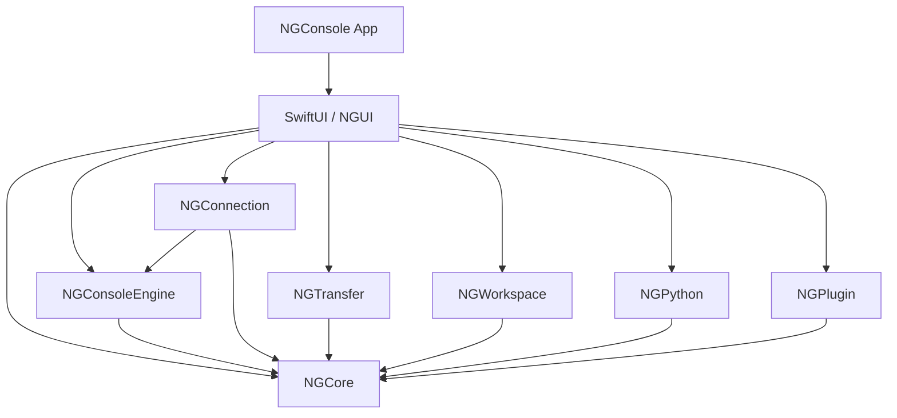
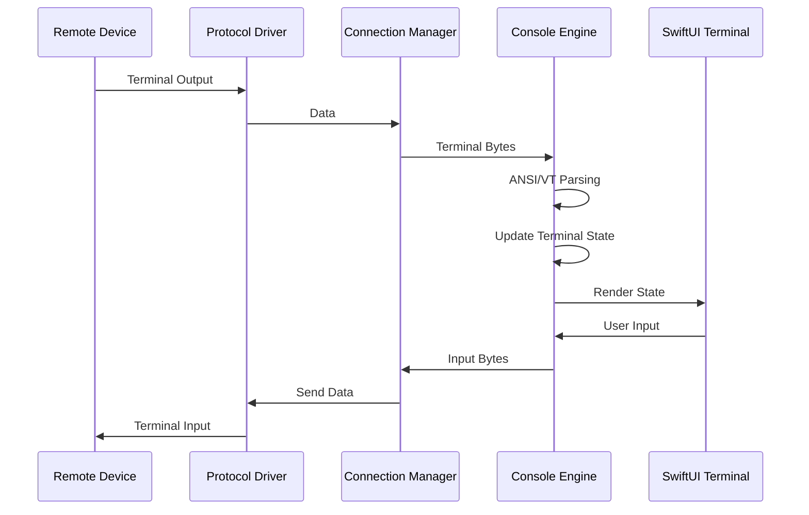
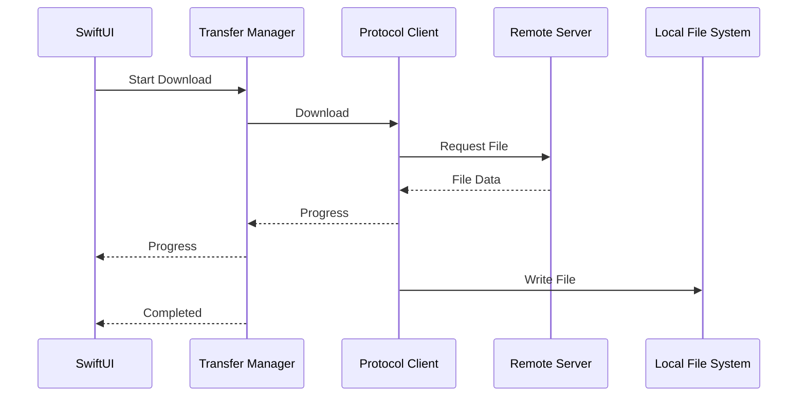

# ARCH-001 — NGConsole Core Architecture
## Part 2: Implementation Architecture

**Project:** NGConsole  
**Document ID:** ARCH-001  
**Part:** 2 of 6  
**Version:** 1.0  
**Status:** Baseline  
**Target Platform:** macOS  
**Language:** Swift  
**UI:** SwiftUI

---

## 1. Purpose

Part 1 defined the architectural boundaries and responsibilities of NGConsole Core.

This document converts those principles into an implementation-oriented structure.

It defines:

- Swift Package organization
- Source directory layout
- Module dependencies
- Public protocol boundaries
- Event model
- Concurrency model
- Terminal I/O data flow
- Connection lifecycle
- Transfer lifecycle
- Plugin lifecycle
- Error propagation
- Logging architecture

The objective is to give developers and AI coding tools a concrete implementation target without prematurely locking the project to a specific third-party library.

---

## 2. Implementation Strategy

NGConsole should be developed in layers.

```text
Presentation
    |
Application State
    |
Core Services
    |
Domain Interfaces
    |
Protocol / System Adapters
    |
macOS / External Libraries
```

A higher layer may depend on abstractions exposed by a lower layer, but UI code must not directly control protocol implementations.

### Primary rule

> **Depend on interfaces, not implementations.**

For example:

```text
ConnectionManager
       |
       v
TerminalTransport
       |
       +---- SSHTransport
       +---- TelnetTransport
       +---- SerialTransport
       +---- LocalShellTransport
```

The Connection Manager should not need to know implementation details of each transport.

---

# 3. Recommended Repository Structure

The initial repository should remain simple.

```text
NGConsole/
├── README.md
├── LICENSE
├── CONTRIBUTING.md
├── CHANGELOG.md
├── Package.swift
│
├── App/
│   └── NGConsoleApp/
│
├── Packages/
│   ├── NGCore/
│   ├── NGConsoleEngine/
│   ├── NGConnection/
│   ├── NGTransfer/
│   ├── NGWorkspace/
│   ├── NGPython/
│   ├── NGPlugin/
│   └── NGUI/
│
├── Plugins/
│   └── README.md
│
├── Tests/
│   ├── NGCoreTests/
│   ├── NGConsoleEngineTests/
│   ├── NGConnectionTests/
│   ├── NGTransferTests/
│   ├── NGWorkspaceTests/
│   ├── NGPythonTests/
│   └── NGPluginTests/
│
├── Resources/
│   ├── Themes/
│   └── Templates/
│
├── Scripts/
│
└── docs/
```

The exact package split may be adjusted during implementation if it creates unnecessary complexity.

---

# 4. Swift Package Structure

The preferred initial package structure is:

```text
NGCore
NGConsoleEngine
NGConnection
NGTransfer
NGWorkspace
NGPython
NGPlugin
NGUI
```

## 4.1 NGCore

Contains shared domain models and interfaces.

Examples:

```text
NGCore
├── Models
├── Errors
├── Events
├── Logging
└── Protocols
```

NGCore must remain lightweight.

It must not depend on SwiftUI.

---

## 4.2 NGConsoleEngine

Contains terminal functionality.

```text
NGConsoleEngine
├── Terminal
├── ANSI
├── VT
├── Buffer
├── Input
├── Selection
├── Search
└── Rendering
```

It may depend on NGCore.

It should not depend on SSH, SFTP, FTP or TFTP implementations.

---

## 4.3 NGConnection

Contains terminal transport implementations.

```text
NGConnection
├── ConnectionManager
├── SSH
├── Telnet
├── Serial
├── LocalShell
└── Transport
```

It may depend on:

- NGCore
- NGConsoleEngine

It must not own SwiftUI views.

---

## 4.4 NGTransfer

Contains file-transfer functionality.

```text
NGTransfer
├── TransferManager
├── SFTP
├── FTP
├── TFTP
├── Client
└── Server
```

It may depend on NGCore.

It must remain independent from NGConsoleEngine.

---

## 4.5 NGWorkspace

Contains workspace persistence and organization.

```text
NGWorkspace
├── WorkspaceManager
├── Persistence
├── Sessions
├── Scripts
├── Logs
├── Downloads
├── Uploads
└── Bookmarks
```

It may depend on NGCore.

---

## 4.6 NGPython

Contains Python process execution.

```text
NGPython
├── PythonManager
├── Process
├── Execution
└── Script
```

It may depend on NGCore.

---

## 4.7 NGPlugin

Contains the plugin contract and plugin lifecycle.

```text
NGPlugin
├── Plugin
├── Manifest
├── Lifecycle
├── Registry
└── Permissions
```

The initial release only needs the framework. Future plugins can be developed independently.

---

## 4.8 NGUI

Contains reusable SwiftUI components.

```text
NGUI
├── TerminalView
├── SessionView
├── TransferView
├── WorkspaceView
├── SettingsView
├── Components
└── Theme
```

NGUI should consume application state and public Core interfaces.

Protocol implementation must not be placed inside views.

---

# 5. Dependency Graph

The preferred dependency graph is:

```text
                    NGPlugin
                       |
                       v
                     NGCore
                       ^
                       |
          +------------+-------------+
          |            |             |
          |            |             |
 NGConsoleEngine   NGWorkspace    NGPython
          ^
          |
    NGConnection

NGTransfer
    |
    +----> NGCore

NGUI
    |
    +----> NGCore
    +----> NGConsoleEngine
    +----> NGWorkspace
    +----> NGConnection
    +----> NGTransfer
    +----> NGPython
```

The Application target assembles these packages.

```text
NGConsoleApp
    |
    +--> NGUI
    +--> NGConnection
    +--> NGTransfer
    +--> NGWorkspace
    +--> NGPython
    +--> NGPlugin
```

### Important

This is a logical dependency graph.

The implementation may combine small packages if splitting them creates unnecessary build or maintenance overhead.

The architectural boundaries are more important than the number of Swift packages.

---

# 6. Public Domain Models

Core models should be protocol-independent.

Example:

```swift
public struct SessionDefinition: Codable, Sendable, Identifiable {
    public let id: UUID
    public var name: String
    public var transport: TransportKind
    public var host: String?
    public var port: Int?
}
```

Transport type:

```swift
public enum TransportKind: String, Codable, Sendable {
    case ssh
    case telnet
    case serial
    case localShell
}
```

Transfer protocol:

```swift
public enum TransferProtocol: String, Codable, Sendable {
    case sftp
    case ftp
    case tftp
}
```

These models must not contain third-party library objects.

---

# 7. Terminal Transport Protocol

A common abstraction should separate the terminal from transport.

```swift
public protocol TerminalTransport: Sendable {
    func connect() async throws
    func disconnect() async
    func send(_ data: Data) async throws
    func resize(columns: Int, rows: Int) async throws
    var output: AsyncThrowingStream<Data, Error> { get }
}
```

The exact API may evolve during implementation.

The architectural requirement is that the Console Engine consumes a generic terminal stream.

---

# 8. Connection Manager Protocol

```swift
public protocol ConnectionManaging: Sendable {
    func connect(
        session: SessionDefinition
    ) async throws -> ConnectionHandle

    func disconnect(
        _ connection: ConnectionHandle
    ) async

    func reconnect(
        _ connection: ConnectionHandle
    ) async throws
}
```

The returned connection handle must be opaque to the UI.

---

# 9. Transfer Protocol

The Transfer Manager should expose a generic transfer abstraction.

```swift
public protocol TransferClient: Sendable {
    func connect() async throws
    func disconnect() async
    func list(path: String) async throws -> [RemoteFile]
    func download(
        remotePath: String,
        localURL: URL,
        progress: @Sendable (TransferProgress) -> Void
    ) async throws
    func upload(
        localURL: URL,
        remotePath: String,
        progress: @Sendable (TransferProgress) -> Void
    ) async throws
}
```

SFTP, FTP and TFTP implementations can conform to the same higher-level contract where the protocol semantics allow it.

Protocol-specific capabilities must not be artificially hidden. For example, if one protocol cannot support a feature, the API must represent that limitation clearly.

---

# 10. Event Model

NGConsole should use structured events rather than direct cross-module UI callbacks wherever practical.

Example:

```swift
public enum NGEvent: Sendable {
    case sessionConnected(UUID)
    case sessionDisconnected(UUID)
    case connectionError(UUID, ErrorInfo)
    case transferStarted(UUID)
    case transferProgress(UUID, TransferProgress)
    case transferCompleted(UUID)
    case transferFailed(UUID, ErrorInfo)
    case pythonStarted(UUID)
    case pythonCompleted(UUID)
    case pluginLoaded(String)
}
```

The event system should remain small.

Do not create a general-purpose event bus for every internal method call.

Direct method calls are preferred when there is a clear ownership relationship.

---

# 11. Concurrency Model

NGConsole should use Swift Concurrency.

Preferred tools:

- `async/await`
- `Task`
- `AsyncStream`
- `AsyncThrowingStream`
- `Actor`
- `@MainActor`
- `Sendable`

### Main Thread Rule

UI state is `@MainActor` isolated.

Networking, file transfer, process execution and protocol parsing must not block the main actor.

```text
MainActor
   |
   +---- SwiftUI
   +---- UI State
   +---- User Interaction

Background Concurrency
   |
   +---- SSH
   +---- Telnet
   +---- Serial I/O
   +---- File Transfer
   +---- Python Process
   +---- Parsing
```

---

# 12. Actor Boundaries

Actors should protect mutable state that can be accessed concurrently.

Examples:

```swift
actor ConnectionStateStore
actor TransferStateStore
actor WorkspaceStore
```

The Console Engine may use an actor or carefully isolated state model depending on rendering requirements.

The initial implementation should avoid creating actors for every class.

> Use concurrency isolation where shared mutable state actually exists.

---

# 13. Terminal I/O Pipeline

The terminal data path should be:

```text
Remote Device
     |
     v
Transport Driver
     |
     | Data
     v
Connection Manager
     |
     v
Console Engine
     |
     +--> ANSI / VT Parser
     |
     +--> Terminal State
     |
     v
UI Rendering
```

User input travels in the opposite direction:

```text
Keyboard
   |
   v
SwiftUI Terminal View
   |
   v
Console Input Handler
   |
   v
Connection Manager
   |
   v
Transport Driver
   |
   v
Remote Device
```

This separation is critical.

---

# 14. Terminal Output Backpressure

Terminal output can arrive faster than the UI can render it.

The implementation must avoid creating an unbounded task for every incoming data chunk.

Preferred approach:

```text
Transport Stream
      |
      v
Input Buffer
      |
      v
Parser
      |
      v
Terminal State
      |
      v
Coalesced UI Updates
```

UI updates should be batched/coalesced when output is very high volume.

This is particularly important for:

- Large `show` commands
- Log output
- Configuration output
- Packet/debug output
- Automated scripts

---

# 15. Connection Lifecycle

A connection should have an explicit state model.

```swift
public enum ConnectionState: Sendable {
    case idle
    case connecting
    case authenticating
    case connected
    case reconnecting
    case disconnecting
    case disconnected
    case failed
}
```

State transitions must be validated.

For example:

```text
idle
  -> connecting
  -> authenticating
  -> connected
  -> disconnecting
  -> disconnected
```

Invalid transitions should not silently modify state.

---

# 16. Transfer Lifecycle

```text
Created
   |
   v
Preparing
   |
   v
Connecting
   |
   v
Transferring
   |
   +----> Cancelled
   |
   +----> Failed
   |
   v
Completed
```

Transfer progress should be represented by structured state.

```swift
public struct TransferProgress: Sendable {
    public let transferredBytes: Int64
    public let totalBytes: Int64?
    public let fractionCompleted: Double?
}
```

The UI should not calculate transfer state from raw protocol messages.

---

# 17. Workspace Data Flow

```text
User
 |
 v
SwiftUI
 |
 v
Workspace ViewModel
 |
 v
Workspace Manager
 |
 v
Workspace Store
 |
 v
File System
```

The Workspace Manager should provide a stable API regardless of the underlying persistence format.

The initial persistence format can be JSON.

Future formats should be possible without rewriting the UI.

---

# 18. Workspace Layout

A minimal workspace can look like:

```text
MyWorkspace/
├── workspace.json
├── sessions/
├── scripts/
├── logs/
├── downloads/
├── uploads/
└── bookmarks/
```

The application should not require users to manually edit these files.

The format is primarily an application persistence mechanism.

---

# 19. Plugin Lifecycle

The Plugin Manager should provide a predictable lifecycle.

```text
Discovered
    |
    v
Validated
    |
    v
Loaded
    |
    v
Initialized
    |
    v
Active
    |
    v
Unloading
    |
    v
Unloaded
```

A failed plugin must not crash the entire application where technically avoidable.

Plugin loading errors should be isolated and logged.

---

# 20. Plugin Boundary

The initial public contract can remain intentionally small.

```swift
public protocol NGPlugin {
    var id: String { get }
    var name: String { get }
    var version: String { get }

    func activate(
        context: PluginContext
    ) async throws

    func deactivate() async
}
```

The plugin context may expose selected Core services.

It must not expose internal implementation details unnecessarily.

---

# 21. Plugin Permissions

Future plugins may require permissions.

Examples:

```text
terminal.read
terminal.write
workspace.read
workspace.write
network.connect
filesystem.read
filesystem.write
process.execute
ai.access
```

The initial release may implement a minimal permission model, but the interface should leave room for it.

Security-sensitive permissions should require explicit user approval.

---

# 22. Error Propagation

Errors should flow through defined boundaries.

```text
Low-Level Error
      |
      v
Protocol Adapter
      |
      v
Domain Error
      |
      v
Core Service
      |
      v
Application State
      |
      v
UI Presentation
```

Do not expose third-party library error types directly to SwiftUI.

Instead:

```swift
public struct ErrorInfo: Sendable, Codable {
    public let code: String
    public let message: String
    public let recoverySuggestion: String?
}
```

The internal error can retain more diagnostic information for logs.

---

# 23. Logging Architecture

Use Apple's unified logging system where appropriate.

Suggested categories:

```text
NGConsole
├── app
├── connection
├── terminal
├── transfer
├── workspace
├── python
├── plugin
└── security
```

Logging levels should distinguish:

- debug
- info
- notice
- warning
- error
- critical

Credentials and secrets must be redacted.

---

# 24. UI Update Strategy

Protocol/network events should not directly mutate SwiftUI views.

Recommended:

```text
Transport
   |
   v
Core State
   |
   v
Observable Application State
   |
   v
SwiftUI
```

This keeps UI rendering deterministic and testable.

---

# 25. Terminal View Model

A terminal view model may expose:

```swift
@MainActor
final class TerminalViewModel: ObservableObject {
    @Published private(set) var connectionState: ConnectionState
    @Published private(set) var terminalState: TerminalState
}
```

The view model should not implement SSH or Telnet.

It coordinates UI state with Core services.

---

# 26. Application Composition Root

The Application target should assemble dependencies.

Conceptually:

```text
NGConsoleApp
     |
     +-- SettingsManager
     +-- WorkspaceManager
     +-- SessionManager
     +-- ConnectionManager
     +-- TransferManager
     +-- PythonManager
     +-- PluginManager
     |
     v
Application Environment
```

Dependency construction should be centralized rather than scattered throughout SwiftUI views.

This makes testing and future replacement easier.

---

# 27. Testing Strategy

Every Core module should be testable without the real network whenever possible.

Examples:

```text
ConnectionManager
    |
    +-- MockTerminalTransport

TransferManager
    |
    +-- MockTransferClient

PythonManager
    |
    +-- MockProcessRunner
```

The architecture must support dependency injection.

---

# 28. Mock Interfaces

Example:

```swift
public protocol ProcessRunning: Sendable {
    func run(
        executable: URL,
        arguments: [String]
    ) async throws -> ProcessResult
}
```

Production:

```text
ProcessRunner
```

Tests:

```text
MockProcessRunner
```

This avoids launching real Python processes for every unit test.

---

# 29. Architecture Diagram



---

# 30. Terminal Data Flow Diagram



---

# 31. Transfer Data Flow Diagram



---

# 32. Implementation Order

The recommended implementation sequence is:

### Phase 1 — Foundation

1. Xcode project
2. Swift Package structure
3. NGCore
4. Logging
5. Error model
6. Dependency injection

### Phase 2 — Console

1. Console Engine
2. Terminal state
3. ANSI parser
4. Scrollback
5. Selection
6. Search/highlight
7. SwiftUI terminal view

### Phase 3 — Connection

1. Local Shell
2. Serial
3. Telnet
4. SSHv2
5. Reconnect
6. Keychain integration

### Phase 4 — Transfer

1. SFTP Client
2. FTP Client
3. TFTP Client
4. SFTP Server
5. FTP Server
6. TFTP Server

### Phase 5 — Workspace

1. Workspace persistence
2. Sessions
3. Scripts
4. Logs
5. Downloads/uploads
6. Bookmarks

### Phase 6 — Python

1. Python discovery
2. Script execution
3. Output capture
4. Cancellation
5. Workspace integration

### Phase 7 — Plugin SDK

1. Plugin manifest
2. Plugin discovery
3. Plugin lifecycle
4. Plugin context
5. Permission foundation
6. Example test plugin

### Phase 8 — AI Plugin

AI should only begin after the Core is stable.

---

# 33. Definition of Done for Part 2

Part 2 is considered implemented when:

- Swift package boundaries are defined.
- Core interfaces are independent of third-party libraries.
- Terminal transport is separated from terminal rendering.
- Transfer protocols are separated from the Console Engine.
- Workspace persistence is isolated.
- Swift Concurrency boundaries are defined.
- UI does not implement protocol logic.
- Errors are translated at module boundaries.
- Logging is centralized.
- Plugin lifecycle is defined.
- Unit testing can use mocks.
- The Application target acts as the composition root.

---

# 34. Architectural Constraints for Claude Code

When using Claude Code or another coding agent, the following rules must be enforced:

1. Do not implement features outside the current milestone.
2. Do not add Device Inventory to Core.
3. Do not add Device Tree to Core.
4. Do not add Live Configuration History to Core.
5. Do not add AI Agent to Core.
6. Do not introduce vendor-specific logic into Core.
7. Do not put networking logic in SwiftUI views.
8. Do not expose third-party library types through public Core APIs.
9. Do not introduce a dependency merely to avoid a small amount of straightforward code.
10. Do not restructure packages without documenting the architectural reason.
11. Prefer async/await over callback-based APIs for new code.
12. Preserve protocol boundaries even when implementing a single feature.
13. Every new cross-module dependency must be reviewed.
14. Every architectural change must have an ADR.

---

# 35. Next Part

**ARCH-001 Part 3 — Console Engine Architecture**

will define:

- Terminal state model
- Screen buffer
- Scrollback architecture
- ANSI parser
- VT100/VT220 behavior
- Cursor model
- Character attributes
- Color model
- Selection model
- Search/highlight
- Input handling
- Terminal resize
- Rendering strategy
- High-volume output handling
- Terminal testing strategy
- Console Engine public interfaces
